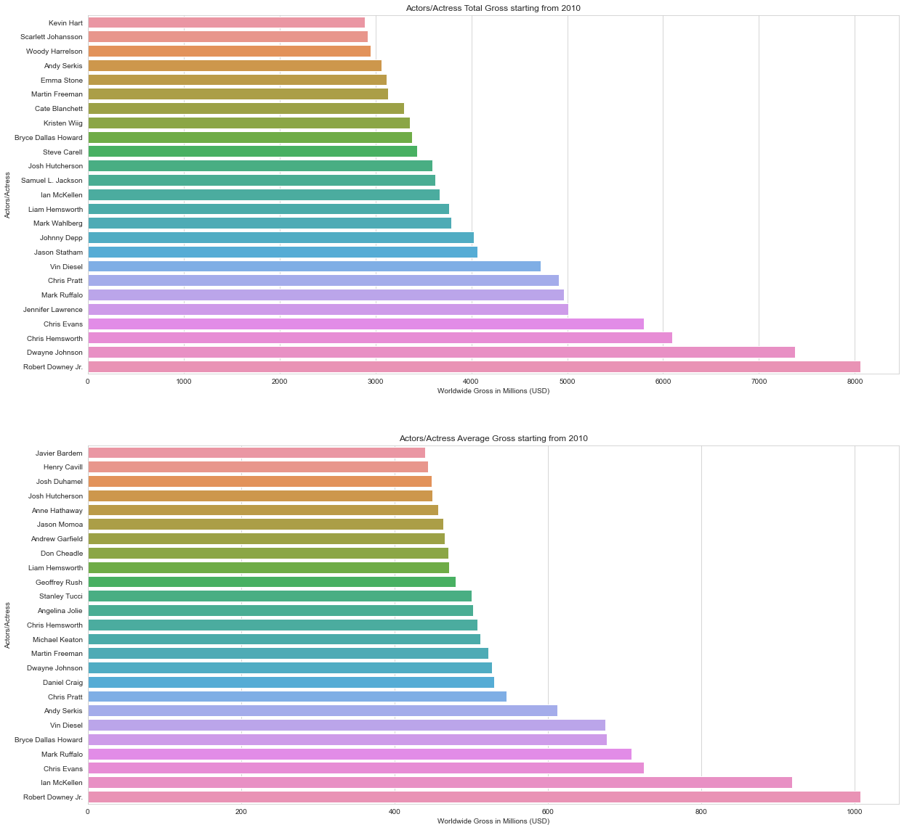

## Movie Gross Analysis

#### Repository Files

- zippedData - Data used for the project

- Htoo Aung Latt Section 1 Final Project.ipynb - Module 1 jupyter notebook

- presentation.pdf - High-level presentation of methodology and recommendations for non-technical stakeholders

- README.md - Descriptions of contents of the repository

## Project Goal

The goal of this project is to analyze the given data for a new movie production company and give reccomendations.

#### Project Process

1. Explore the Data

2. Clean the Data

3. Find patterns

4. Interpret the Data

